## Description

Scenario: A S1rBank client reported unauthorized transactions. The victim received an SMS urging a banking app update via a link, which installed a dormant app mimicking the bank’s official version. Once activated, it stole credentials, bypassed 2FA via SMS interception, and exfiltrated data. As a DFIR specialist, analyze the Android disk image to uncover the malware’s operation, reconstruct the attack chain, and identify critical IoCs.

> Author: 0xS1rx58

## Solution

Đề bài cho 1 file zip khá nặng. Bên trong chứa 1 file pcap và 1 file dd. 

> Q1: Provide the UTC timestamp of the phishing SMS.

Mở file dd bằng FTK Imager, mình thấy như sau: 

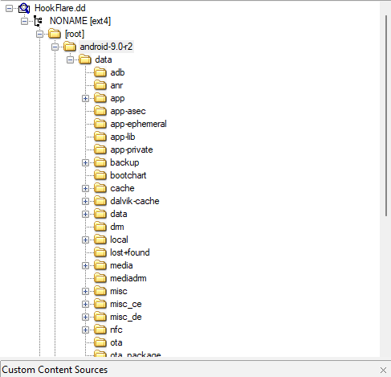

Kết hợp với đề bài thì đây là 1 bài Mobile Forensics. Mình khá ít tiếp xúc với loại này. Vì nó chứa cả unllocated space nên mình đoán là nó sẽ chứa cả các file đã bị xóa. Load vào Autopsy để có cái nhìn trực quan hơn về đống file bị xóa. Từ câu hỏi có thể thấy ngay cần xác định SMS được gửi đến nạn nhân. Mình search GG để tìm đường dẫn đến nơi lưu trữ SMS. 

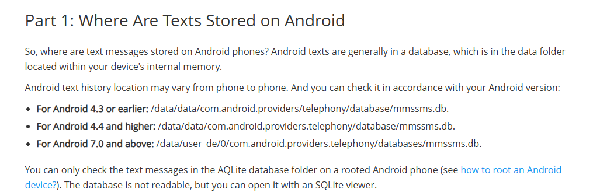

Vì không rõ phiên bản của nó nên mình thử 2 cái cuối. 4.4 sai và với đường dẫn ở phiên bản 7.0 trở lên thì mình tìm thấy file `mmssms.db`. Load nó vào `DB Browser` và tìm được phishing SMS. Chỉ cần đổi timestamp sang UTC và submit.

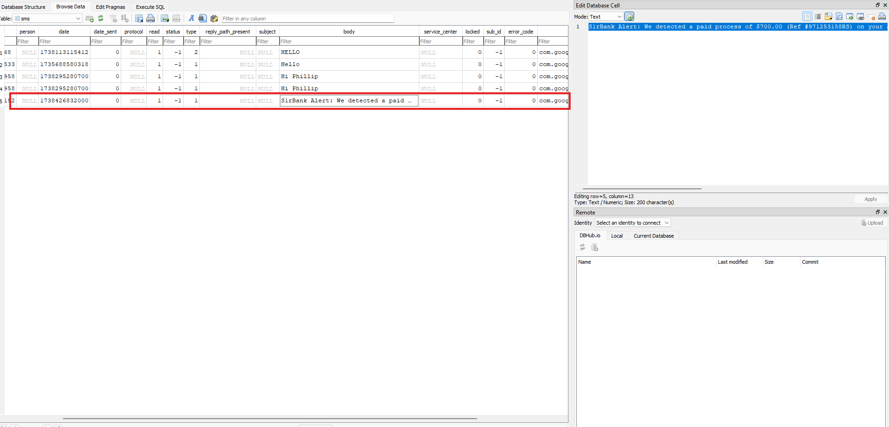

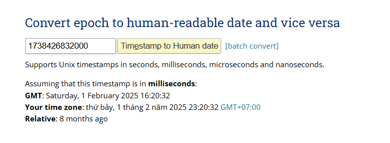

ANS: `2025-02-01 16:20:32`

> Q2: Provide the UTC timestamp marking the start of the malicious application download.

Ở đường dẫn `/data/media/0/Downloads`, mình tìm thấy file nạn nhân tải xuống nhưng nhập thì không chính xác. 

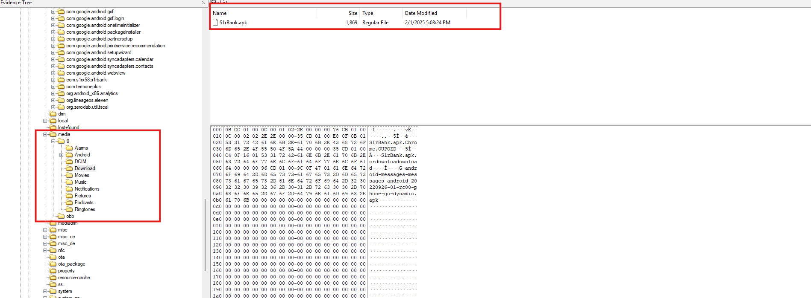

Tìm tiếp ở đường dẫn `/data/data/com.android.providers.downloads/databases/`. Ở đây chứa 1 file db cung cấp cho ta lịch sử tải xuống. Load file `downloads.db` vào `DB Browser`, mình thấy file cần tìm. Convert sang timestamp và submit. Hehe tưởng đến đây ngon ăn rồi. Mà không, wrong!!!!!. 

Vì sai nên mình nghĩ sang hướng thứ 2 như mình hay làm với Windows Forensics: File History của trình duyệt. Mình thử tìm trình duyệt như Chrome, Firefox... ở đường dẫn `data/data` thì thấy `com.android.chrome`. Check đường dẫn đầy đủ là `/data/data/com.android.chrome/app_chrome/Default/`. Export file `History` và load vào `DB Browser`, mình thấy duy nhất 1 file được tải xuống. Sử dụng công cụ [này](https://www.epochconverter.com/webkit) để convert sang UTC. Submit lại và thành công. 

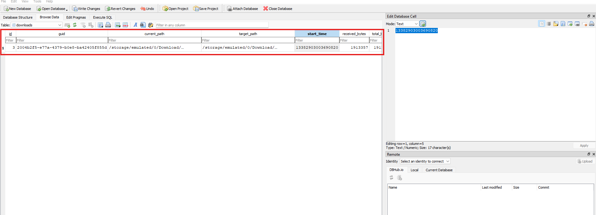

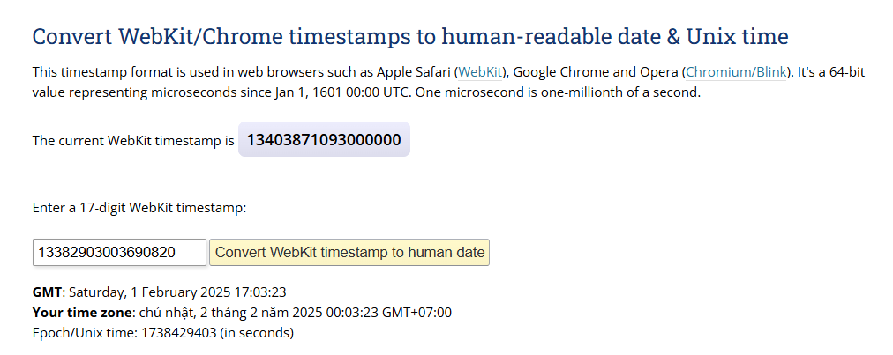

Mất gần 30p, cay thật. 

ANS: `2025-02-01 17:03:23`

> Q3: Provide the package name of the malicious application.

Này mình lấy luôn kết quả kiểm tra ở Q2. Ở Q2 mình check thêm cả file `packages.xml` ở đường dẫn `/data/system` để tìm thời gian download mà nó sai. File này chứa các bản ghi các gói tải xuống. Cần Ctrl + F và ghi tên của file apk là tìm được đáp án. 

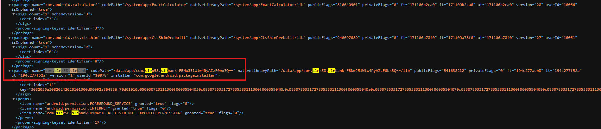

ANS: `com.s1rx58.s1rbank`

> Q4: Provide the number of runtime permissions granted to the malicious application.

Kiểm tra file `runtime-permissions.xml` ở đường dẫn `/data/system/user/0`, Ctrl + F tên gói và đếm là ra. Tổng là 4. 

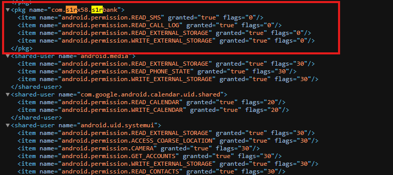

ANS: `4`

> Q5: Provide the last access timestamp for the read sms permission used by the malicious application.

Câu này khá mất thời gian. Mình loay hoay mãi nên hỏi chat luôn, mà cũng không có manh mối. Đến khi mình hỏi anh em trong CLB thì biết đến `logcat`. Áp dụng từ khóa này vào, mình biết đến file `appops.xml`. 

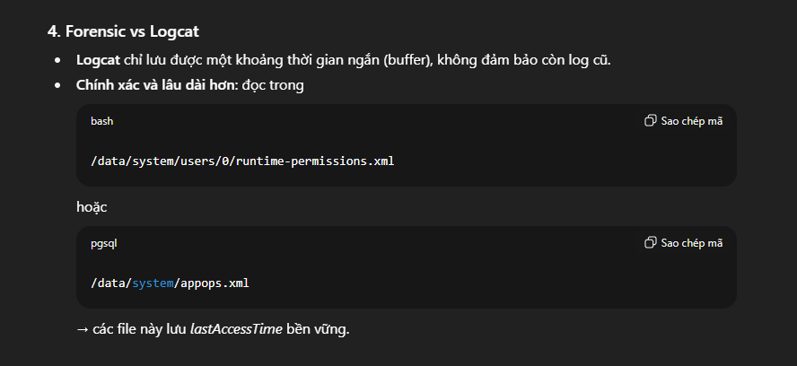

File này là `nơi Android lưu trạng thái và lịch sử của AppOps – tức là các “operation” mà ứng dụng đã thực hiện, liên quan trực tiếp đến việc truy cập quyền nhạy cảm`. Search theo tên gói, ta được kết quả như sau: 

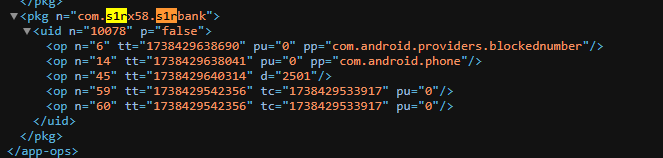

Ta đối chiếu được `op n="14"` sẽ ứng với OP_READ_SMS ([Check tại đây](https://android.googlesource.com/platform/frameworks/base/%2B/1a008c1/core/java/android/app/AppOpsManager.java)). Việc còn lại là đổi timestamp và submit thôi. 

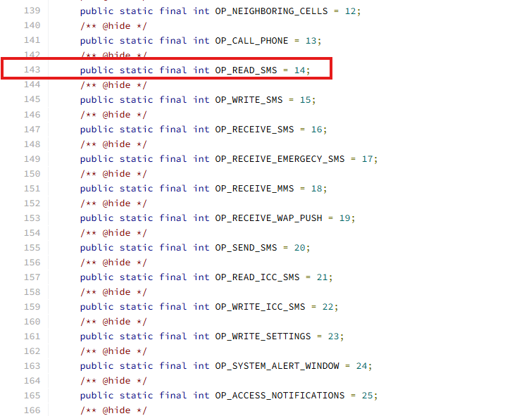

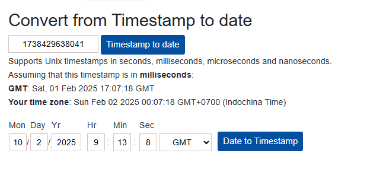

ANS: `2025-02-01 17:07:18`

> Q6: Provide the URL used by the malware for data exfiltration.

Câu này liên quan đến reverse một chút. Mình sử dụng `jadx` để dịch ngược file này. Sau khi dịch ngược thì nó ra khá là nhiều file nên mình dùng luôn công cụ thần thánh: `grep`. 

Kết hợp với file pcap: 

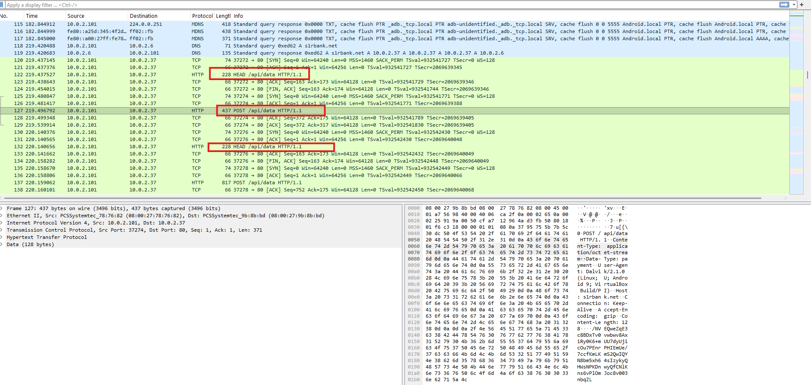

Và may mắn là nó ra ở cuối luôn: 

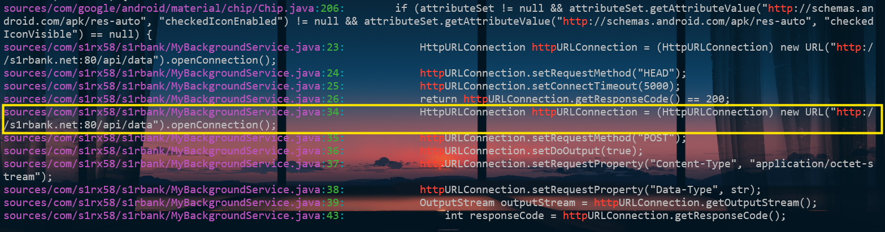

ANS: `http://s1rbank.net:80/api/data`

> Q7: The malicious application checks if the server is live before sending data. Provide the HTTP method used for this check.

Từ Q6 thì mình check luôn file `MyBackgroundService.java`. Có thể thấy hàm check ở ngay đầu tiên. 

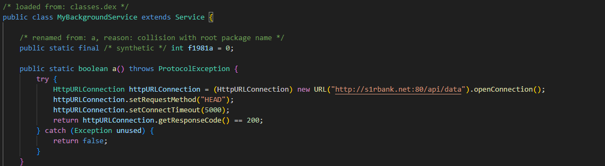

Sử dụng HTTP method là HEAD, gửi request tới URL ở Q6 để kiểm tra.

ANS: `HEAD`

> Q8: If the primary server is unavailable, the malicious application redirects data exfiltration to an alternate URL. Identify and provide the alternate URL.

Vẫn là kết quả được grep từ Q6, mình thấy luôn 1 cái Discord Webhook. Submit phát là ăn ngay. 

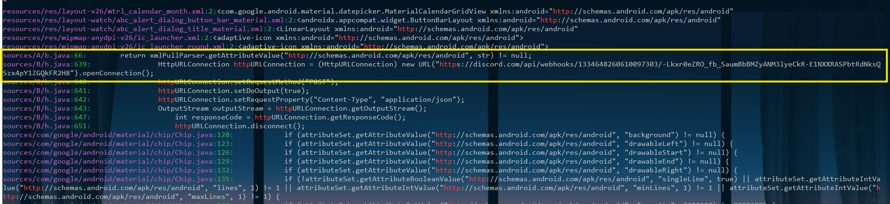

ANS: `https://discord.com/api/webhooks/1334648260610097303/-Lkxr0eZRO_fb_SaumBbBMZyANM3lyeCkR-E1NXXRASPbtRdNksQSzx4pY1ZGQkFR2H8`

> Q9: The malicious application encrypts data before sending it to the server. Provide the encryption key used.

Sử dụng kết quả từ Q8, mình check file `h.java`. Xem qua 1 chút sẽ thấy luôn key sử dụng để mã hóa, sử dụng mã hóa AES.

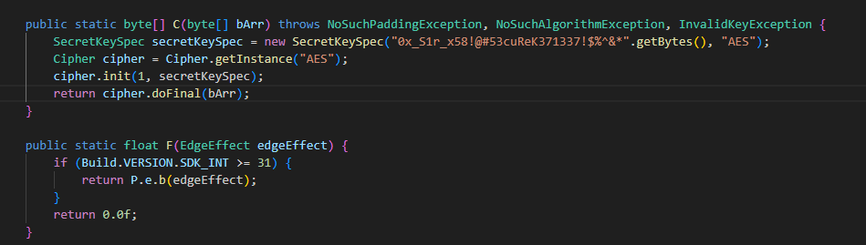

ANS: `0x_S1r_x58!@#53cuReK371337!$%^&*`

> Q10: Credit card information was stolen. What was the second line in the exfiltrated payment information?

Giờ đơn giản là chỉ cần giải mã data exfiltration. Phần data có thể được tìm thấy từ file pcap: `File -> Export Objects -> HTTP`. 

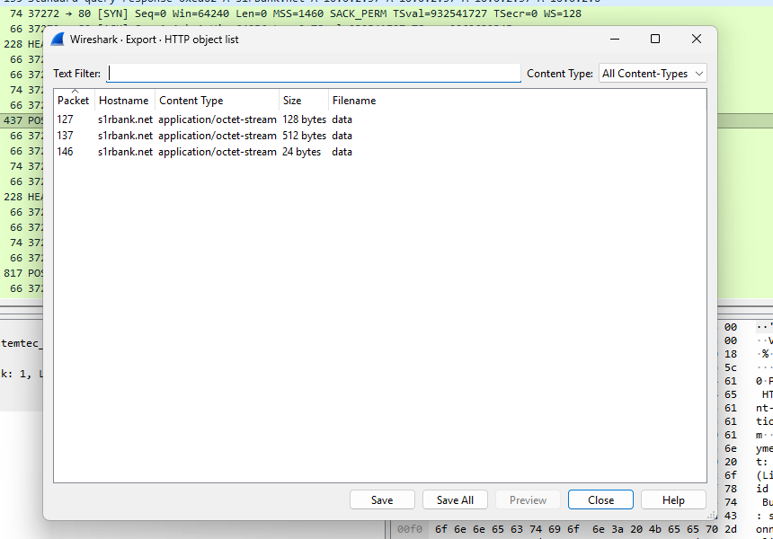

Quan trọng là nó sử dụng mode mã hóa nào. Mình thử search GG thì thấy kết quả [đầu tiên](https://stackoverflow.com/questions/6258047/java-default-crypto-aes-behavior) có vẻ khả quan. 

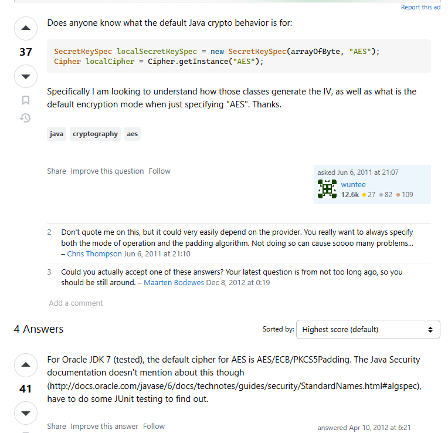

Khi không đề cập mode mã hóa AES, trong Java sẽ mặc định sử dụng mode `ECB`. Giờ thì vứt vào `Cyberchef` là xong, với key đã tìm thấy ở Q9. 

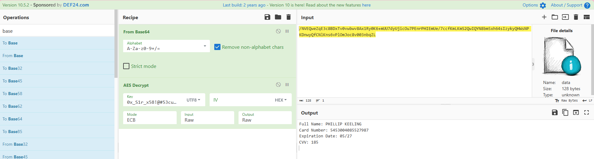

ANS: `Card Number: 5453004085527987`

Tổng kết lại là load vào Autopsy chả có tác dụng méo gì. 

