## Description

Khá lâu rồi mình mới có thời gian để ngồi làm xong viết mấy bài như này. Phần vì mình sắp kết thúc quãng thời gian sinh viên nên không còn nhiều thời gian, phần vì lười và không có động lực như hồi năm nhất, năm hai. Cảm ơn các bạn đã đọc và đồng hành cùng mình suốt quãng thời gian vừa qua.

Scenario: John is an employee at a mid-sized tech company. He works as a Senior IT support specialist, but his true passion is finding ways to make extra money. John is always on the lookout for giveaways, discounts, and any opportunity to earn a quick buck. He’s not particularly tech-savvy when it comes to cybersecurity, but he’s resourceful and knows how to follow online tutorials.

Recently, John came across an enticing giveaway that promised exciting rewards. However, when he opened the giveaway, he didn’t find or win anything. This made him suspicious that something might have gone wrong with his machine. Concerned about the unusual behavior, John has reached out to you, the investigator, to uncover what happened and whether his system has been compromised.

> Author: M4shl3

## Solution

Đề bài cho một file zip được tạo bởi KAPE.Như thường lệ thì mình dùng `FTK Imager` để mở nó lên cho dễ quan sát. Bài này mình mất rất nhiều thời gian để làm vì mắc mấy câu đầu. Mấy lần định cố làm cho xong thì khó quá nên bỏ.

> Q2: The previous malicious file executed an initial payload. What is the full path of this payload?

Mình đặt câu này lên trước vì mình dùng câu này mới tìm ra được đáp án Q1. Mình (thề) đã check toàn bộ lịch sử tải xuống, $J, Recent, log... để tìm file .lnk ở Q1 nhưng không tìm thấy. Và do mình luôn để ý các EID cố định nên mình đã bị miss khi check `Powershell log`. Nhờ anh `@m1ho4n` nên mình mới nhận ra mình chỉ check 1 phần của `Powershell log` mà không check các EID khác trong đó. Nhờ hint của anh mà mình check lại EID 600 và tìm được đáp án. 

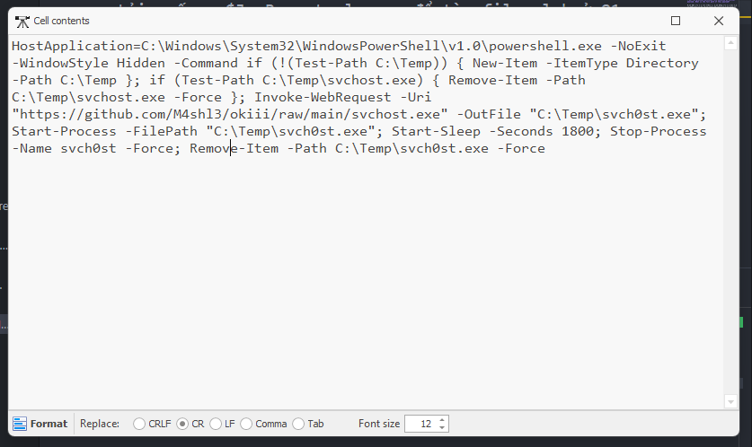

ANS: `C:\Temp\svch0st.exe`

> Q3: At what timestamp did the payload execute and grant the attacker shell access?

Với câu này thì mình sử dụng đáp án ở Q2 và check `Prefetch` là được.

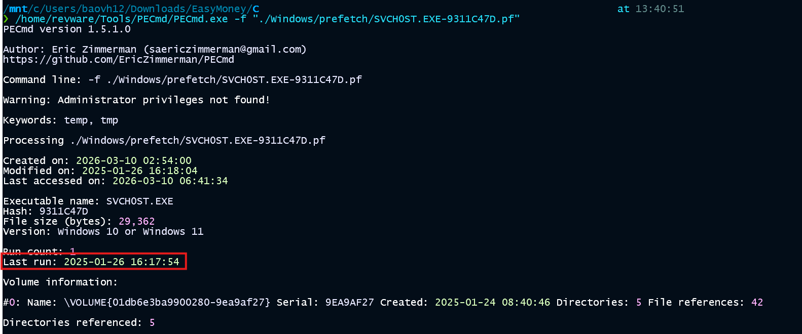

ANS: `2025-01-26 16:17:54`

> Q1: At what exact time did the user execute the malicious shortcut file?

Với câu này thì mình check `Prefetch` với từ khóa là đáp án Q2. Ngoài chính bản thân thằng `svch0st.exe` khi chạy sẽ sinh ra `.pf` thì mình thấy được thằng `powershell.exe` cũng khởi chạy nó. Hiểu đơn giản thì attacker dùng powershell chạy file `svch0st.exe`. Các bạn có thể xem rõ hơn ở payload mình chụp ở Q2. Có khoảng 14 timestamp nhưng mình lấy cái gần với thời gian ở Q2 nhất là đáp án chuẩn.

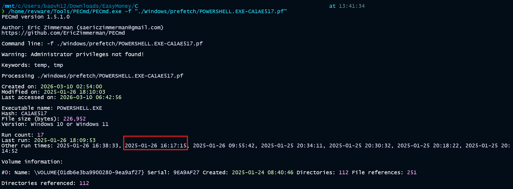

ANS: `2025-01-26 16:17:15`

> Q4: What is the command line the attacker used to enumerate installed packages on the system?

Câu này thì ta check EID `4103` là ra. 

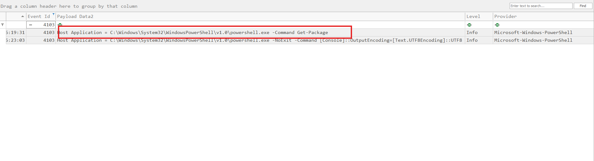

ANS: `C:\Windows\System32\WindowsPowerShell\v1.0\powershell.exe -Command Get-Package`

> Q5: What version of that vulnerable application did the attacker identify?

Mình check lịch sử tải xuống của trình duyệt thì user này có sử dụng `Yandex`. Sau khi phân tích mã độc ở Q9 thì điều này càng được củng cố hơn. Cả từ `Technology` của HTB thì nó cũng ghi Yandex luôn rồi :).

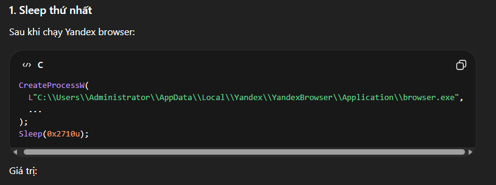

ANS: `YandexBrowser`

> Q6: What version of that vulnerable application did the attacker identify?

Câu này mình dùng `AmCacheParser` để parser file `Amcache.hve` ở đường dẫn `C:\Windows\AppCompat\Programs` thành các file `.csv`. Sau đó check `UnassociatedFileEntries.csv` là ra đáp án. 

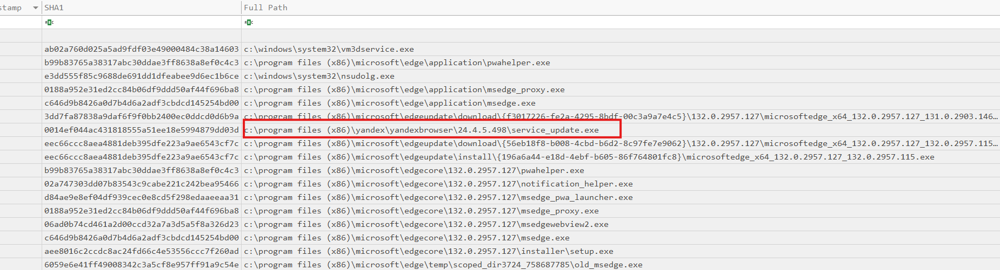

Hoặc check MFT entry.

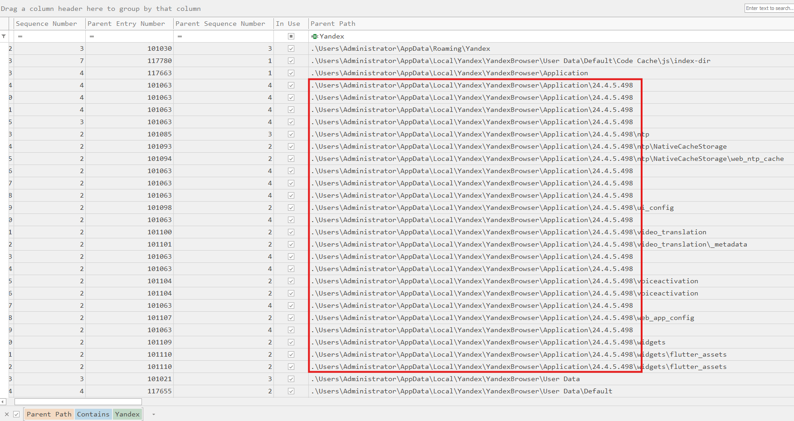

Nói chung là có nhiều cách.

ANS: `24.4.5.498`

> Q7: What is the CVE associated with this vulnerability?

Câu này thì mình search GG với đáp án của Q6 và tìm được [bài viết này](https://sploitus.com/exploit?id=D1D7BFF1-E1AA-5D2B-B118-0E57F0CBC9C6)

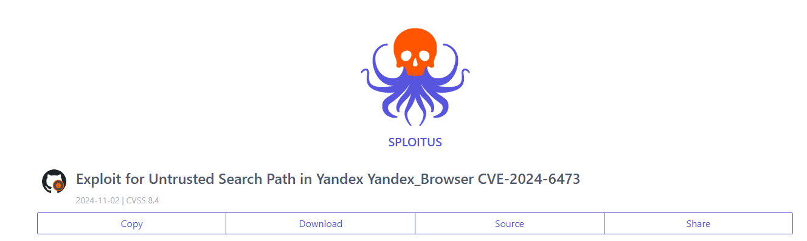

ANS: `CVE-2024-6473`

> Q8: What is the name of the legitimate binary that the attacker used to deliver the malicious payload and establish persistence on the compromised system?

Câu này mình gần như không tìm được dữ kiện nào. Cho đến khi mình check `LocalLow` thì thấy một số file được tải xuống và lưu trữ tại đây. Cộng thêm kiểm tra `Prefetch` thì mình chắc chắn được đáp án là `certutil.exe`.

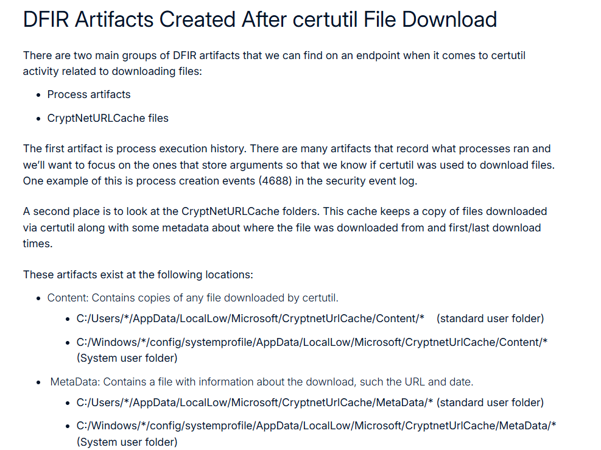

ANS: `certutil.exe`

> Q9: What is the name of the malicious Portable Executable (PE) file that enabled him to accomplish his objective?

Mình check các file ở đường dẫn `C:/Users/*/AppData/LocalLow/Microsoft/CryptnetUrlCache/MetaData` theo Q8 và tìm được đáp án. 

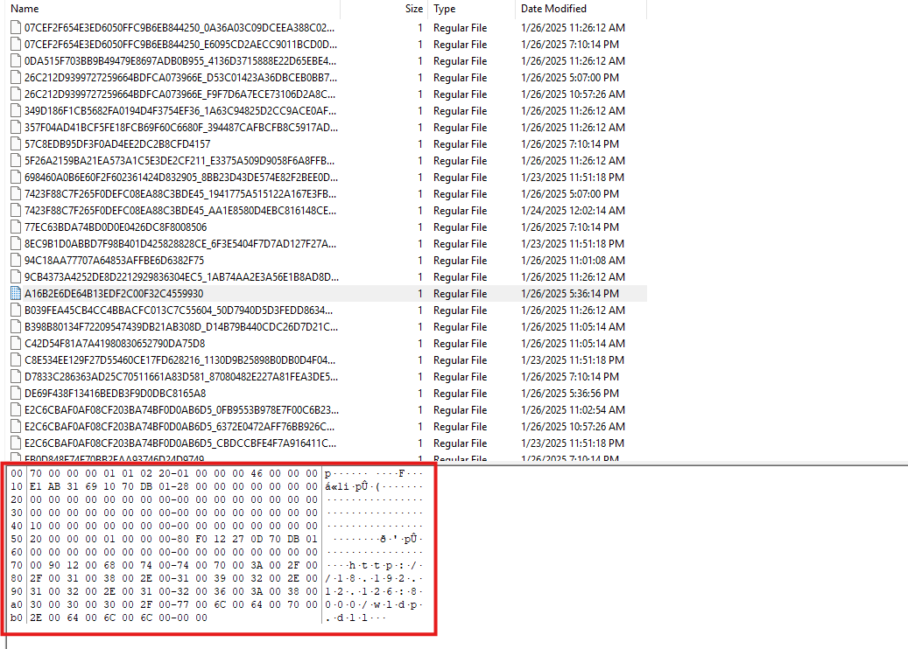

ANS: `wldp.dll`

> Q10: What is the SHA-256 hash of that malicious file?

Mình cho lên `VirusTotal` để lấy kết quả.

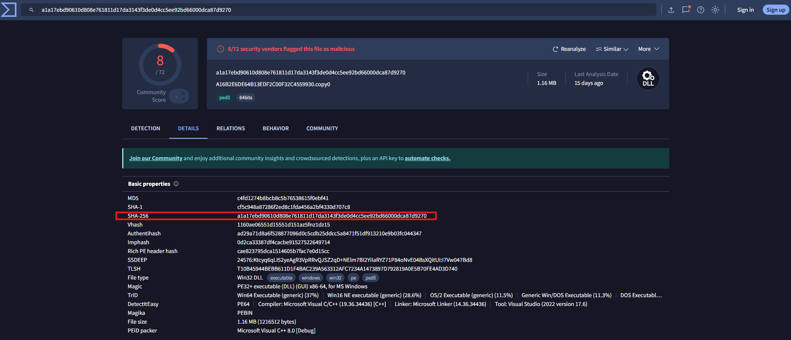

ANS: `A1A17EBD90610D808E761811D17DA3143F3DE0D4CC5EE92BD66000DCA87D9270`

> Q11: How many milliseconds of cumulative coded sleep delays occurred before the C2 binary provided a shell after the vulnerable application was launched?

Mình không chuyên về `reverse malware` nên mình đã cho con chat đọc mã nguồn để tìm đáp án. 

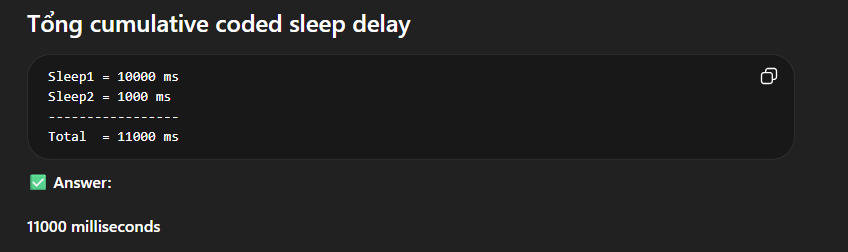

ANS: `11000`

> Q12: What is the mutex name used to ensure only one instance of the C2 binary runs at a time?

Tương tự Q11. 

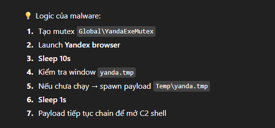

ANS: `Global\\YandaExeMutex`

> Q13: What is the full path of the Command and Control (C2) Binary?

Cũng từ `C:/Users/*/AppData/LocalLow/Microsoft/CryptnetUrlCache/MetaData` mình thấy một file khác có tên `yanda.tmp`. Check `MFT entry` để tìm đường dẫn đầy đủ.

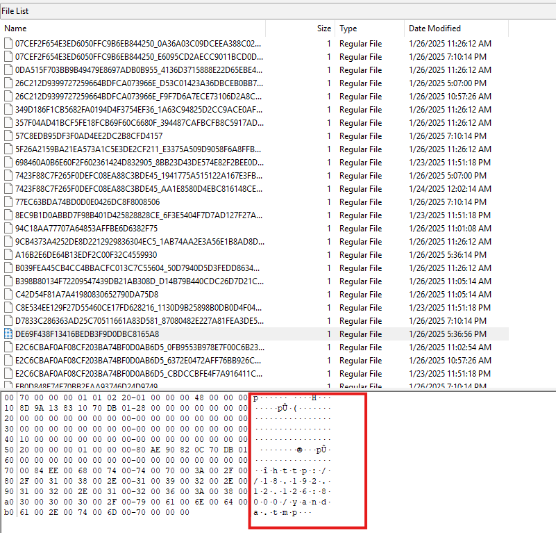

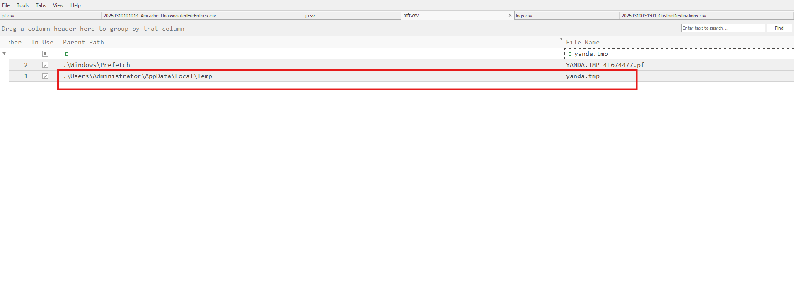

ANS: `C:\Users\Administrator\AppData\Local\Temp\yanda.tmp`

> Q14: What is the name of the C2 framework used by the attacker?

Lấy file ở Q13 ra từ đường dẫn `C:/Users/*/AppData/LocalLow/Microsoft/CryptnetUrlCache/Content/*`. Sau đó mình cho lên VirusTotal là ra đáp án. 

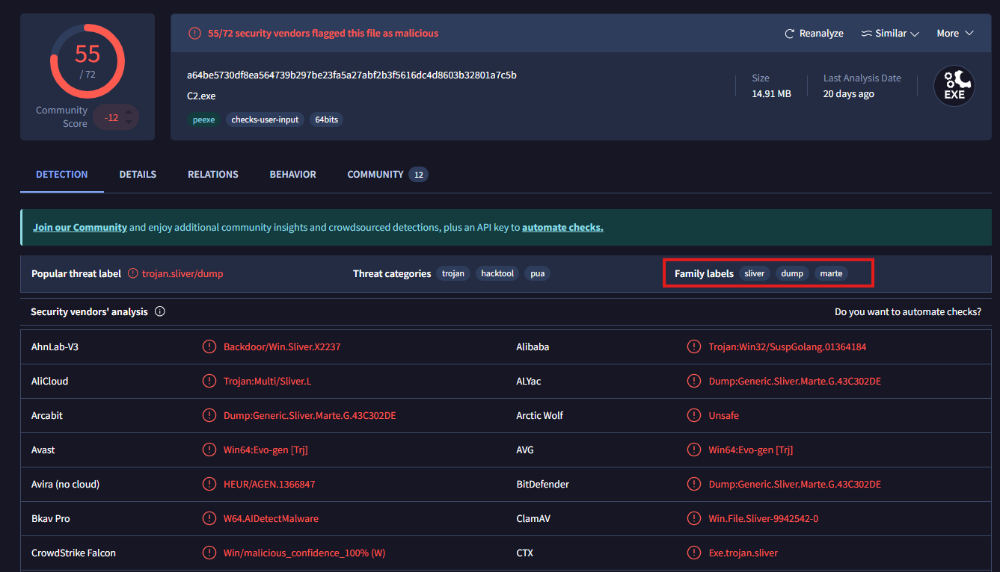

ANS: `sliver`

> Q15: What is the IP address and port number of the malicious C2 server used by the attacker?

Tương tự check phần Behavior trên VirusTotal. 

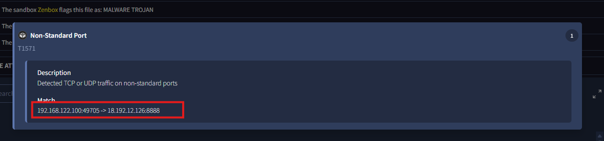

ANS: `18.192.12.126:8888`