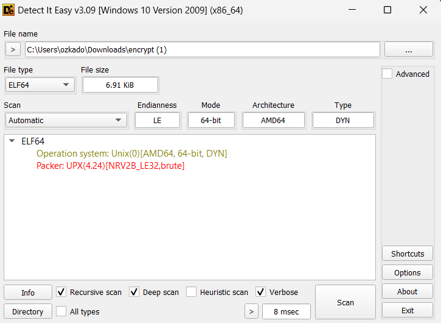
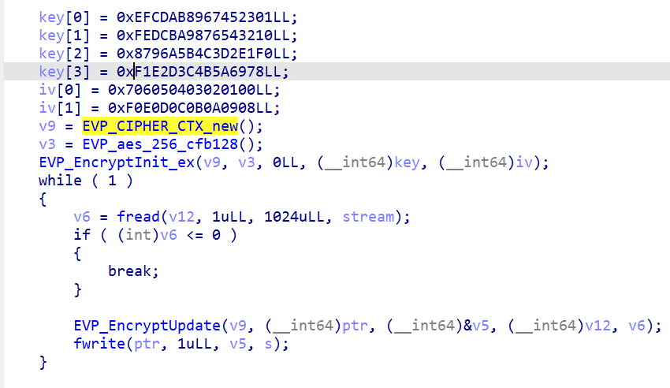
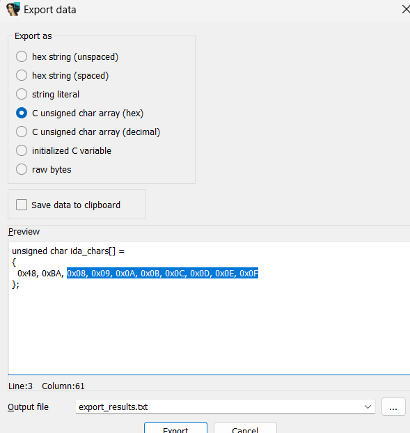
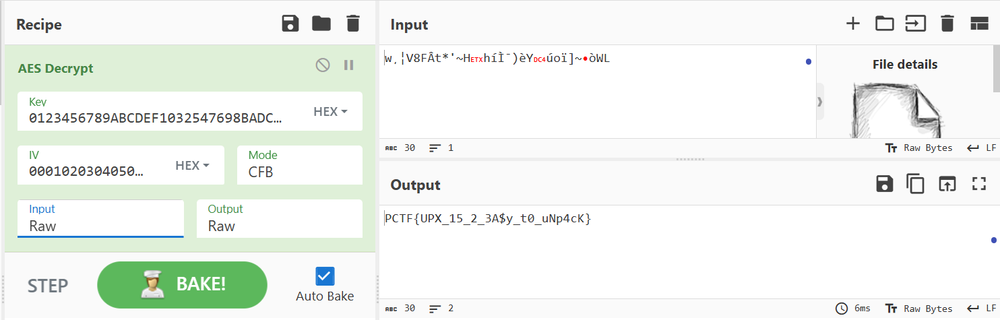

Giải này có nhiều challenge Forensics nhưng mình không làm được bài nào. Đành thử mấy bài RE. Ok let's go!

# Rev/Packed Full Of Surprises
## Description

I encrypted a file with a secret flag, but now I can't seem to figure out how to decrypt it, can you help?

> Author: Txnner

## Solution
Bài cho ta 1 file `txt` và 1 file `elf`. Ban đầu mình load vào IDA thì nó khá lộn xộn. Mình load nó vào DIE và phát hiện nó đã bị packed bằng `UPX`.



Dùng UPX unpack lại, sau đó load lại vào IDA.

<details>
    <summary>Click</summary>

```pseudocode
int __fastcall main(int argc, const char **argv, const char **envp)
{
    __int64 v3; // rax
    int v5; // [rsp+0h] [rbp-870h] BYREF
    unsigned int v6; // [rsp+4h] [rbp-86Ch]
    FILE *stream; // [rsp+8h] [rbp-868h]
    FILE *s; // [rsp+10h] [rbp-860h]
    __int64 v9; // [rsp+18h] [rbp-858h]
    __int64 v10[2]; // [rsp+20h] [rbp-850h] BYREF
    __int64 v11[4]; // [rsp+30h] [rbp-840h] BYREF
    char v12[1024]; // [rsp+50h] [rbp-820h] BYREF
    char ptr[1048]; // [rsp+450h] [rbp-420h] BYREF
    unsigned __int64 v14; // [rsp+868h] [rbp-8h]

    v14 = __readfsqword(0x28u);
    stream = fopen("flag.txt", "rb");
    s = fopen("flag.txt.enc", "wb");
    if ( !stream || !s )
    {
        handleErrors("Error opening file");
    }

    v11[0] = 0xEFCDAB8967452301LL;
    v11[1] = 0xFEDCBA9876543210LL;
    v11[2] = 0x8796A5B4C3D2E1F0LL;
    v11[3] = 0xF1E2D3C4B5A6978LL;
    v10[0] = 0x706050403020100LL;
    v10[1] = 0xF0E0D0C0B0A0908LL;
    v9 = EVP_CIPHER_CTX_new();
    v3 = EVP_aes_256_cfb128();
    EVP_EncryptInit_ex(v9, v3, 0LL, v11, v10);
    while ( 1 )
    {
        v6 = fread(v12, 1uLL, 0x400uLL, stream);
        if ( (int)v6 <= 0 )
        {
            break;
        }

        EVP_EncryptUpdate(v9, ptr, &v5, v12, v6);
        fwrite(ptr, 1uLL, v5, s);
    }

    EVP_EncryptFinal_ex(v9, ptr, &v5);
    fwrite(ptr, 1uLL, v5, s);
    EVP_CIPHER_CTX_free(v9);
    fclose(stream);
    fclose(s);
    return 0;
}
```                  
</details>

Đoạn mã này sử dụng mã hóa AES với mode CFB để mã hóa file `flag.txt` thành file `flag.txt.enc`. Giờ ta cần tìm key và IV để giải mã. Ta thấy hàm `EVP_EncryptInit_ex` là hàm lấy vào hai biến v11 và v10. Mình search xem nó là gì. Sau đây là cấu trúc của hàm này:

```
int EVP_EncryptInit_ex(EVP_CIPHER_CTX *ctx, const EVP_CIPHER *type,ENGINE *impl, const unsigned char *key, const unsigned char *iv)
```

Từ đây mình biết được nó sử dụng v11 làm key và v10 là iv, mình sửa lại tên biến cho dễ nhìn:



Ban đầu mình nghĩ đơn giản là lắp key và iv vào là giải mã được, nhưng không hiểu sao nó lại không ra. Sau đó nhờ hint của anh @ducdatdau là nó sử dụng `little endian`. Dễ hiểu thì trong bộ nhớ, nó sẽ sắp xếp từ giá trị nhỏ nhất ở vị trí đầu tiên -> các số lớn sau. Do đó, mình cần lấy từ sau về trước. Ở đây mình dùng 2 cách để giải:

`Cách 1:`
Dùng `shift + E` để extract key và iv từ mã giả, sau đó đưa file mã hóa, key và iv vào `Cyberchef`. Khi dùng `shift + E`, ta được kết quả như hình:



Mình không biết ở đâu ra 2 thằng `0x48` và `0xBA`, nhưng không lấy hai giá trị này nhé. Sau đó cần loại bỏ các kí tự 0x và dấu phẩy.



`Cách 2:` Code :

```python
from Crypto.Cipher import AES

def to_little_endian(hex_str):

    cleaned_str = hex_str.replace('0x', '').replace('LL', '')
    if len(cleaned_str) % 2 != 0:
        cleaned_str = '0' + cleaned_str
    little_endian_str = ''.join(reversed([cleaned_str[i:i+2] for i in range(0, len(cleaned_str), 2)]))
    return little_endian_str

v11_0 = to_little_endian('0xEFCDAB8967452301LL')
v11_1 = to_little_endian('0xFEDCBA9876543210LL')
v11_2 = to_little_endian('0x8796A5B4C3D2E1F0LL')
v11_3 = to_little_endian('0xF1E2D3C4B5A6978LL')
v10_0 = to_little_endian('0x706050403020100LL')
v10_1 = to_little_endian('0xF0E0D0C0B0A0908LL')

key = bytes.fromhex(v11_0 + v11_1 + v11_2 + v11_3)
iv = bytes.fromhex(v10_0 + v10_1)

print(f"Key: {key.hex()}")
print(f"IV: {iv.hex()}")

with open('flag.txt.enc', 'rb') as f:
    encrypted_data = f.read()

print(f"Encrypted data (hex): {encrypted_data.hex()}")

cipher = AES.new(key, AES.MODE_CFB, iv, segment_size=128)
decrypted_data = cipher.decrypt(encrypted_data)

print("Decrypted Data (UTF-8):", decrypted_data.decode('utf-8'))
```

FLAG: `PCTF{UPX_15_2_3A$y_t0_uNp4cK}`
   
## References

- https://www.geeksforgeeks.org/little-and-big-endian-mystery/

- https://docs.openssl.org/1.0.2/man3/EVP_EncryptInit/#synopsis

# Rev/Password protector
## Description

We've been after a notorious skiddie who took the "Is it possible to have a completely secure computer system" question a little too literally. After he found out we were looking for them, they moved to live at the bottom of the ocean in a concrete box to hide from the law. Eventually, they'll have to come up for air...or get sick of living in their little watergapped world. They sent us this message and executable. Please get their password so we can be ready.

"Mwahahaha you will nOcmu{9gtufever crack into my passMmQg8G0eCXWi3MY9QfZ0NjCrXhzJEj50fumttU0ympword, i'll even give you the key and the executable:::: Zfo5ibyl6t7WYtr2voUEZ0nSAJeWMcN3Qe3/+MLXoKL/p59K3jgV"

> Author: zephyrone3956
    
## Solution
Đề bài cho ta 1 file pyc. Mình dùng [Pylingual](https://www.pylingual.io/) để decompile nó, ta được đoạn mã sau:

```python
# Decompiled with PyLingual (https://pylingual.io)
# Internal filename: passwordProtector.py
# Bytecode version: 3.11a7e (3495)
# Source timestamp: 2024-06-24 01:36:28 UTC (1719192988)

import os
import secrets
from base64 import *

def promptGen():
    flipFlops = lambda x: chr(ord(x) + 1)
    with open('topsneaky.txt', 'rb') as f:
        first = f.read()
    bittys = secrets.token_bytes(len(first))
    onePointFive = int.from_bytes(first) ^ int.from_bytes(bittys)
    second = onePointFive.to_bytes(len(first))
    third = b64encode(second).decode('utf-8')
    bittysEnc = b64encode(bittys).decode('utf-8')
    fourth = ''
    for each in third:
        fourth += flipFlops(each)
    fifth = f"Mwahahaha you will n{fourth[0:10]}ever crack into my pass{fourth[10:]}word, i'll even give you the key and the executable:::: {bittysEnc}"
    return fifth

def main():
    print(promptGen())
if __name__ == '__main__':
    main()
```

Đại khái nó mở file `topsneaky.txt`, đọc dưới dạng byte (first) -> tạo một chuỗi byte ngẫu nhiên bằng hàm `secrets.token_bytes` có độ dài tương tự nội dung file và lưu vào bittys -> XOR 2 chuỗi byte, lưu vào `onePointFive` -> chuyển đổi chuỗi đã xor thành byte, sau đó mã hóa bằng base64 -> giải mã về UTF-8 (third) -> mã hóa `bittys` thành base64 và chuyển về `UTF-8(bittyEnc)` -> Tạo chuỗi mới bằng cách sử dụng hàm `flipFlops` thay đổi mỗi kí tự trong chuỗi base64 (third), với mỗi kí tự được cộng thêm 1 giá trị ASCII -> tạo chuỗi `fifth`. Okay, giờ là cách để giải mã. Từ des của chall, ta lấy được các giá trị:

```txt
fourth[0:10] = "Ocmu{9gtuf"
fourth[:10] = "MmQg8G0eCXWi3MY9QfZ0NjCrXhzJEj50fumttU0ymp"
bittysEnc = "Zfo5ibyl6t7WYtr2voUEZ0nSAJeWMcN3Qe3/+MLXoKL/p59K3jgV"
```

Ta sẽ kết hợp 2 phần của `fourth` -> đảo ngược `flipFlops` -> decode base64 để lấy `second` -> giải mã `bittyEnc` -> xor second và key vừa nhận được ở giải mã bittyEnc.

```python
import base64

def reverse_flip_flops(encoded_str):
    return ''.join([chr(ord(x) - 1) for x in encoded_str])

def xor_decrypt(encoded_bytes, key_bytes):
    return bytes([b1 ^ b2 for b1, b2 in zip(encoded_bytes, key_bytes)])

fourth_part_0_10 = "Ocmu{9gtuf"
fourth_part_10 = "MmQg8G0eCXWi3MY9QfZ0NjCrXhzJEj50fumttU0ymp"
bittys_enc = "Zfo5ibyl6t7WYtr2voUEZ0nSAJeWMcN3Qe3/+MLXoKL/p59K3jgV"

fourth = fourth_part_0_10 + fourth_part_10

reversed_flips = reverse_flip_flops(fourth)

while len(reversed_flips) % 4 != 0:
    reversed_flips += '='

decoded_bytes = base64.b64decode(reversed_flips)
print("Decoded bytes (second): ", decoded_bytes)

bittys = base64.b64decode(bittys_enc)
print("Decoded key (bittys): ", bittys)

original_content = xor_decrypt(decoded_bytes, bittys)
print("Original content (bytes): ", original_content)

try:
    print("Original content (string): ", original_content.decode('utf-8'))
except UnicodeDecodeError:
    print("Original content is not valid UTF-8. Raw bytes shown above.")

```

FLAG: `PCTF{I<3$3CUR1TY_THR0UGH_0B5CUR1TY!!}`